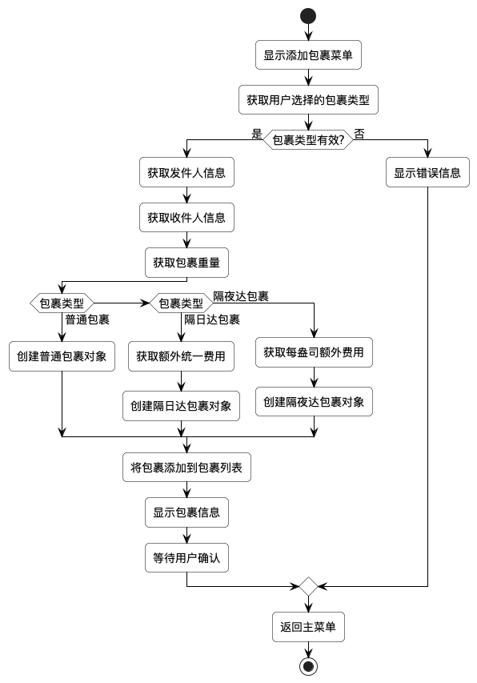
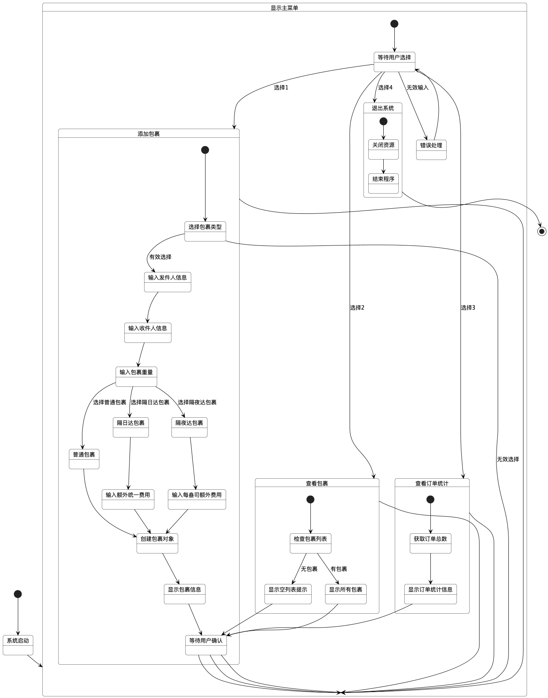

# 包裹快递服务系统项目文档

## 目录

- [包裹快递服务系统项目文档](#包裹快递服务系统项目文档)
  - [目录](#目录)
  - [1. 系统功能概述](#1-系统功能概述)
    - [1.1 主要功能](#11-主要功能)
    - [1.2 功能流程图](#12-功能流程图)
  - [2. 系统算法说明](#2-系统算法说明)
    - [2.1 包裹费用计算算法](#21-包裹费用计算算法)
    - [2.2 输入验证算法](#22-输入验证算法)
  - [3. 系统内部逻辑组织结构](#3-系统内部逻辑组织结构)
    - [3.1 总体结构](#31-总体结构)
    - [3.2 模型层（Model）](#32-模型层model)
    - [3.3 显示层（Display）](#33-显示层display)
    - [3.4 主程序（ParcelExpressSystem）](#34-主程序parcelexpresssystem)
    - [3.5 Maven 项目结构](#35-maven-项目结构)
  - [4. 系统总体方案](#4-系统总体方案)
    - [4.1 系统架构](#41-系统架构)
    - [4.2 类图](#42-类图)
    - [4.3 状态图](#43-状态图)
    - [4.4 时序图](#44-时序图)
    - [4.5 协作图](#45-协作图)
    - [4.6 系统交互流程](#46-系统交互流程)
    - [4.7 系统扩展性](#47-系统扩展性)
    - [4.8 Maven 构建和依赖管理](#48-maven-构建和依赖管理)
      - [Maven 配置](#maven-配置)
      - [主要依赖](#主要依赖)

## 1. 系统功能概述

### 1.1 主要功能

包裹快递服务系统是一个模拟FedEx、DHL和UPS等快递公司的包裹投递服务的命令行应用程序。系统主要提供以下功能：

1. **添加包裹**：用户可以添加三种类型的包裹：
   - 普通包裹：基本的包裹类型，按重量计费
   - 隔日达包裹：在普通包裹基础上加收固定费用
   - 隔夜达包裹：在普通包裹基础上按重量加收额外费用

2. **查看包裹信息**：用户可以查看系统中所有已添加包裹的详细信息，包括：
   - 包裹类型
   - 发件人和收件人信息
   - 包裹重量
   - 包裹费用

3. **查看订单统计**：用户可以查看系统中的订单总数。

### 1.2 功能流程图

以下是添加包裹的流程图：



## 2. 系统算法说明

### 2.1 包裹费用计算算法

系统中不同类型的包裹采用不同的费用计算算法：

1. **普通包裹**：
   ```
   总费用 = 包裹重量 × 每盎司基本运费(1.16美元)
   ```

2. **隔日达包裹**：
   ```
   总费用 = 包裹重量 × 每盎司基本运费(1.16美元) + 额外统一费用
   ```

3. **隔夜达包裹**：
   ```
   总费用 = 包裹重量 × (每盎司基本运费(1.16美元) + 每盎司额外费用)
   ```

费用计算算法流程图如下：


### 2.2 输入验证算法

系统对用户输入进行严格验证，确保数据的有效性：

1. **菜单选择验证**：
   - 验证用户输入是否为有效的整数
   - 验证输入的数字是否在菜单选项范围内

2. **包裹信息验证**：
   - 验证包裹重量是否为正数
   - 验证额外费用是否为正数
   - 验证联系人信息是否完整

3. **异常处理机制**：
   - 捕获并处理用户输入异常
   - 提供友好的错误提示
   - 在连续多次错误输入后自动退出系统

## 3. 系统内部逻辑组织结构

### 3.1 总体结构

系统采用分层设计，主要分为模型层（Model）和显示层（Display）两个主要部分，以及一个主程序（ParcelExpressSystem）作为系统入口。


### 3.2 模型层（Model）

模型层负责定义系统的数据结构和业务逻辑，包括以下类：

1. **Package类**：
   - 作为基类，表示普通包裹
   - 存储发件人和收件人信息、包裹重量
   - 定义基本的费用计算方法
   - 维护系统订单总数的静态变量

2. **TwoDayPackage类**：
   - 继承自Package类，表示隔日达包裹
   - 添加额外统一费用属性
   - 重写费用计算方法，加入额外统一费用

3. **OvernightPackage类**：
   - 继承自Package类，表示隔夜达包裹
   - 添加每盎司额外费用属性
   - 重写费用计算方法，使用不同的计算公式

4. **ParcelContact类**：
   - 表示包裹的联系人信息
   - 存储姓名、地址、城市、州/省、邮编和电话信息

模型层采用面向对象的继承体系，通过多态实现不同类型包裹的费用计算。

### 3.3 显示层（Display）

显示层负责与用户交互，处理输入输出，包括以下类：

1. **MenuDisplay类**：
   - 负责显示各种菜单界面
   - 提供颜色代码常量，美化界面显示
   - 包含主菜单、添加包裹菜单等

2. **InputHandler类**：
   - 处理用户输入
   - 验证输入数据的有效性
   - 转换输入数据为适当的类型

3. **PackageManager类**：
   - 管理包裹的添加、显示等功能
   - 协调各个组件之间的交互

4. **PackageInfoDisplay类**：
   - 负责显示包裹的详细信息
   - 格式化包裹信息的输出

显示层采用单一职责原则，每个类负责特定的功能，提高代码的可维护性。

### 3.4 主程序（ParcelExpressSystem）

主程序是系统的入口点，负责以下功能：

1. **初始化系统**：
   - 创建包裹列表
   - 初始化输入流

2. **主循环**：
   - 显示主菜单
   - 获取用户选择
   - 根据用户选择调用相应的功能
   - 处理异常情况

3. **资源管理**：
   - 在系统退出时关闭资源
   - 处理运行时异常

主程序采用循环结构，不断接收用户输入并执行相应操作，直到用户选择退出系统。

### 3.5 Maven 项目结构

项目采用Maven进行构建和依赖管理：

```
parcel-express-service-system/
├── src/
│   ├── main/
│   │   └── java/
│   │       └── com/
│   │           └── uednd/
│   │               └── parcelpost/
│   │                   ├── model/
│   │                   │   ├── Package.java
│   │                   │   ├── TwoDayPackage.java
│   │                   │   ├── OvernightPackage.java
│   │                   │   └── ParcelContact.java
│   │                   ├── display/
│   │                   │   ├── MenuDisplay.java
│   │                   │   ├── InputHandler.java
│   │                   │   ├── PackageManager.java
│   │                   │   └── PackageInfoDisplay.java
│   │                   └── ParcelExpressSystem.java
│   └── test/
│       └── java/
│           └── com/
│               └── uednd/
│                   └── parcelpost/
│                       ├── PackageTest.java
│                       ├── ParcelContactTest.java
│                       └── UseTestCases.java
├── target/        # Maven构建输出目录
├── docs/
│   ├── diagrams/  # UML图表
│   │   ├── out/   # 图表输出
│   │   └── ...    # 各种UML文件
│   ├── project_document.md
│   └── project_requirements.md
├── pom.xml        # Maven项目配置文件
└── README.md      # 项目说明文件
```


## 4. 系统总体方案

### 4.1 系统架构

包裹快递服务系统采用简单的分层架构，将数据模型和用户界面分离，提高系统的可维护性和可扩展性。


### 4.2 类图

系统的类图展示了各个类之间的关系和主要属性、方法：


### 4.3 状态图

状态图展示了系统在运行过程中的各种状态和状态转换：



### 4.4 时序图

时序图展示了系统中对象之间的交互顺序：


### 4.5 协作图

协作图展示了系统中对象之间的协作关系：


### 4.6 系统交互流程

系统的主要交互流程如下：

1. **系统启动**：
   - 初始化包裹列表和输入流
   - 显示主菜单

2. **用户操作**：
   - 用户选择菜单选项
   - 系统验证输入

3. **功能执行**：
   - 根据用户选择执行相应功能
   - 显示操作结果

4. **返回主菜单或退出**：
   - 功能执行完成后返回主菜单
   - 用户选择退出时关闭资源并结束程序

### 4.7 系统扩展性

系统设计考虑了扩展性，可以通过以下方式进行扩展：

1. **添加新的包裹类型**：
   - 继承Package类
   - 实现特定的费用计算方法

2. **增加新的功能**：
   - 在主程序中添加新的菜单选项
   - 在PackageManager中添加相应的方法

3. **改进用户界面**：
   - 修改MenuDisplay类
   - 添加更多的显示选项

4. **增强数据持久化**：
   - 添加数据存储功能
   - 实现包裹信息的保存和加载

### 4.8 Maven 构建和依赖管理

项目使用Maven进行构建和依赖管理，主要配置和依赖如下：

#### Maven 配置

项目的 `pom.xml` 文件定义了以下主要配置：

```xml
<groupId>com.uednd</groupId>
<artifactId>Parcel_Express_Service_System</artifactId>
<version>1.1.2</version>
```

#### 主要依赖

1. **JUnit 5**：用于单元测试
   ```xml
    <dependency>
        <groupId>org.junit.jupiter</groupId>
        <artifactId>junit-jupiter-api</artifactId>
        <version>5.13.1</version>
        <scope>test</scope>
    </dependency>
   ```

2. **Lombok**：
   ```xml
    <dependency>
        <groupId>org.projectlombok</groupId>
        <artifactId>lombok</artifactId>
        <version>1.18.38</version>
        <scope>provided</scope>
    </dependency>
   ```

使用Maven可以通过简单的命令完成项目的构建、测试和打包：

- `mvn compile`：编译项目
- `mvn test`：运行测试
- `mvn package`：打包项目
- `mvn clean install`：清理、构建、安装到本地仓库 